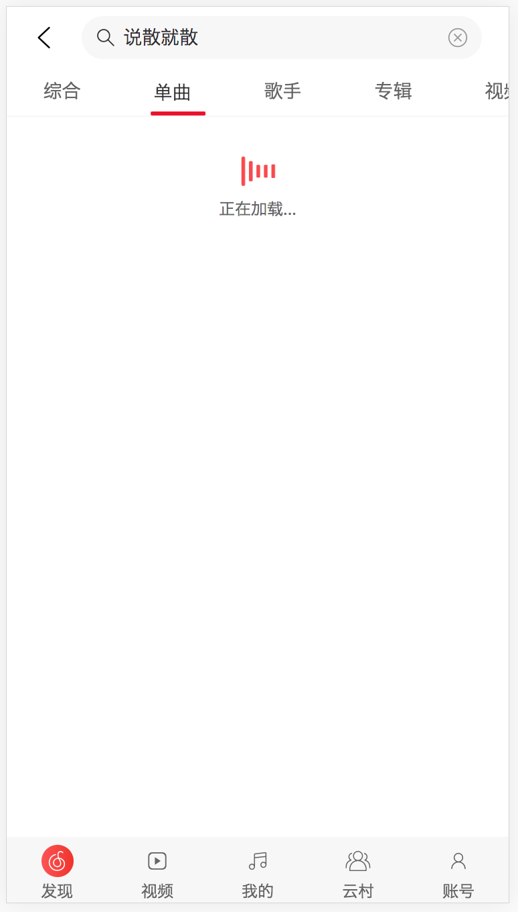

# music-app

**高仿网易云音乐app-web版**

+ 未做兼容处理、Chrome上体验更佳

### 实现的功能

1. 音乐播放、暂停、上一曲、下一曲、歌词
2. 每次播放的歌曲获取歌单、会记录到本地缓存、方便下一首自动播放
3. 搜索单曲、歌手
4. 热门搜索
5. 搜索历史记录
6. 排行榜
7. 歌词
8. 下载
9. 登录
10. 每日推荐MV

**正在进行的功能**

+ 删除播放列表、播放歌曲
+ 我喜欢
+ 电台
+ 巅峰榜单、新歌推荐
+ 拖拽进度条

## Build Setup
```bash
# 安装依赖
npm install
# 启动服务
npm run serve
# 打包发布
npm run build
```

## 服务端

> 感谢Binaryify提供的API
>
> [Node.js API service](https://github.com/Binaryify/NeteaseCloudMusicApi)

### 安装

```bash
# 安装服务
$ git clone https://github.com/Binaryify/NeteaseCloudMusicApi.git
# 安装依赖
$ npm install
# 运行
$ node app.js
```


## 项目截图
### 首屏加载


### 播放页

> 实现功能

+ 暂停/播放
+ 切换歌曲
+ 下载歌曲
+ 歌词滚动
+ 音乐进度条


### 发现页

> 目前只有推荐歌单可以用


### 搜索页面

> 搜索功能
>
> + 热搜建议
> + 搜索建议
> + 热搜榜




### Customize configuration
See [Configuration Reference](https://cli.vuejs.org/config/).

